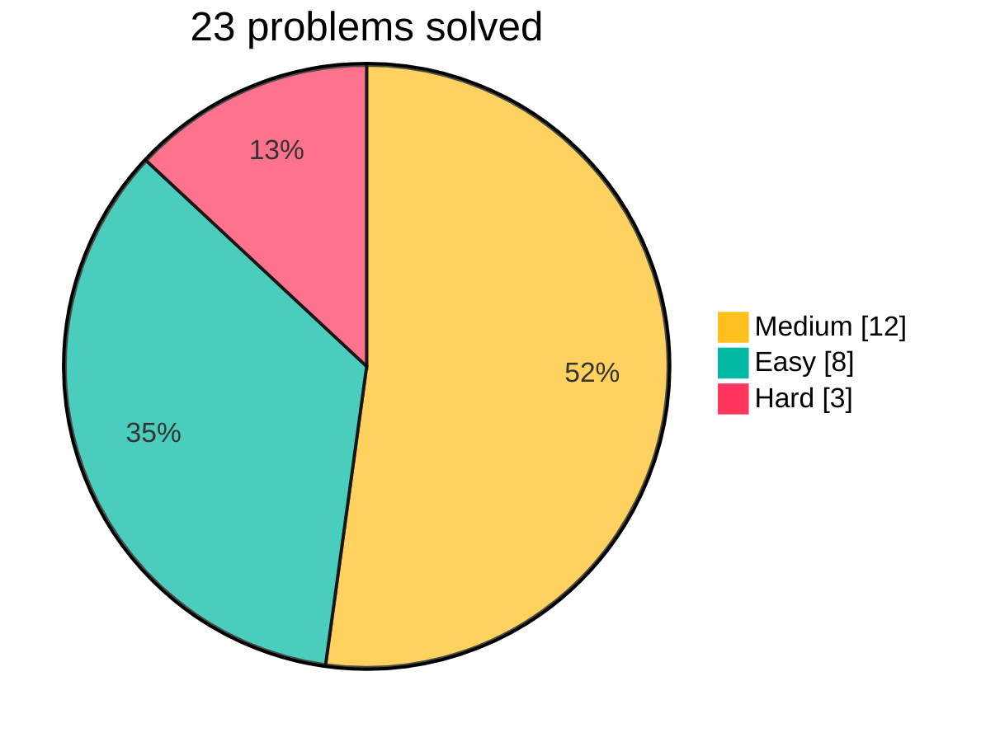

# Leetcode daily

yeah, in big 2026

## Solved so far

### From the daily challenge

#### September 2026

| Day | ID | Title | Level | Files |
| ---: | ---: | --- | --- | --- |
| 11 | 3483 | Unique 3-Digit Even Numbers | Easy | [notes](./src/3483/index.md) · [solution](./src/3483/index.py) |
| 14 | 836 | Rectangle Overlap | Easy | [notes](./src/836/index.md) · [solution](./src/836/index.py) |
| 17 | 1477 | Find Two Non-overlapping Sub-arrays Each With Target Sum | Medium | [notes](./src/1477/index.md) · [solution](./src/1477/index.py) |
| 19 | 1401 | Circle and Rectangle Overlapping | Medium | [notes](./src/1401/index.md) · [solution](./src/1401/index.py) |
| 20 | 3498 | Reverse Degree of a String | Easy | [notes](./src/3498/index.md) · [solution](./src/3498/index.py) |
| 21 | 3524 | Find X Value of Array I | Medium | [notes](./src/3524/index.md) · [solution](./src/3524/index.py) |
| 23 | 1658 | Minimum Operations to Reduce X to Zero | Medium | [notes](./src/1658/index.md) · [solution](./src/1658/index.py) |
| 24 | 3550 | Smallest Index With Digit Sum Equal to Index | Easy | [notes](./src/3550/index.md) · [solution](./src/3550/index.py) |
| 25 | 1096 | Brace Expansion II | Hard | [notes](./src/1096/index.md) · [solution](./src/1096/index.py) |
| 26 | 1807 | Evaluate the Bracket Pairs of a String | Medium | [notes](./src/1807/index.md) · [solution](./src/1807/index.py) |
| 27 | 1190 | Reverse Substrings Between Each Pair of Parentheses | Medium | [notes](./src/1190/index.md) · [solution](./src/1190/index.py) |
| 28 | 1614 | Maximum Nesting Depth of the Parentheses | Easy | [notes](./src/1614/index.md) · [solution](./src/1614/index.py) |
| 29 | 2267 | Check if There Is a Valid Parentheses String Path | Hard | [notes](./src/2267/index.md) · [solution](./src/2267/index.py) |
| 30 | 1111 | Maximum Nesting Depth of Two Valid Parentheses Strings | Medium | [notes](./src/1111/index.md) · [solution](./src/1111/index.py) |

#### October 2026

| Day | ID | Title | Level | Files |
| ---: | ---: | --- | --- | --- |
| 1 | 20 | Valid Parentheses | Easy | [notes](./src/20/index.md) · [solution](./src/20/index.py) |
| 2 | 22 | Generate Parentheses | Medium | [notes](./src/22/index.md) · [solution](./src/22/index.py) |
| 3 | 32 | Longest Valid Parentheses | Hard | [notes](./src/32/index.md) · [solution](./src/32/index.py) |
| 4 | 678 | Valid Parenthesis String | Medium | [notes](./src/678/index.md) · [solution](./src/678/index.py) |
| 5 | 856 | Score of Parentheses | Medium | [notes](./src/856/index.md) · [solution](./src/856/index.py) |

### From the problem list

| ID | Title | Level | Files |
| ---: | --- | --- | --- |

### From contests

| ID | Title | Level | Contest | Files |
| ---: | --- | --- | --- | --- |
| 4056 | Number of Intersecting Interval Pairs I | Easy | [Weekly 520](https://leetcode.com/contest/weekly-contest-520/) Q1 | [notes](./src/4056/index.md) · [solution](./src/4056/index.py) |
| 4057 | Number of Intersecting Interval Pairs II | Medium | [Weekly 520](https://leetcode.com/contest/weekly-contest-520/) Q2 | [notes](./src/4057/index.md) · [solution](./src/4057/index.py) |
| 4058 | Maximum Pulse Value After One Subarray Rotation | Medium | [Weekly 520](https://leetcode.com/contest/weekly-contest-520/) Q3 | [notes](./src/4058/index.md) · [solution](./src/4058/index.py) |
| 4065 | Rearrange Array by Removing Distinct Values | Easy | [Weekly 521](https://leetcode.com/contest/weekly-contest-521/) Q1 | [notes](./src/4065/index.md) · [solution](./src/4065/index.py) |

## Stats

<!-- stats:start -->

<!-- stats:end -->

## AI use disclaimer

> [!IMPORTANT]
> Every solution in this repo is my own. AI is used around the solutions, never to write them.

This project has a few agents with clear limits:
- **Solution feedback**: only runs after I already have an accepted solution. It discusses complexity, style, alternative approaches and edge cases as ideas only, and never gives me code.
- **Grammar review**: proofreads the English in my notes without changing the code or my technical meaning.
- **Animations**: helps build the interactive p5.js visualizations of some solutions.
- **Scaffolding**: creates the folder for a new problem from the template and adds its row to these tables.
