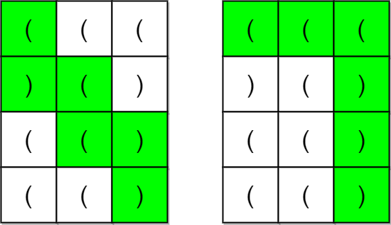
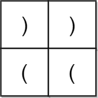

# [2267. Check if There Is a Valid Parentheses String Path](https://leetcode.com/problems/check-if-there-is-a-valid-parentheses-string-path/description)

**Level**: <span style="color:red">Hard</span>

A parentheses string is a non-empty string consisting only of `'('` and `')'`. It is valid if any of the following conditions is true:

- It is `()`.
- It can be written as `AB` (`A` concatenated with `B`), where `A` and `B` are valid parentheses strings.
- It can be written as (`A`), where `A` is a valid parentheses string.

You are given an `m x n` matrix of parentheses `grid`. **A valid parentheses string path** in the grid is a path satisfying all of the following conditions:

- The path starts from the upper left cell `(0, 0)`.
- The path ends at the bottom-right cell `(m - 1, n - 1)`.
- The path only ever moves down or right.
- The resulting parentheses string formed by the path is valid.

Return `true` if there exists a valid parentheses string path in the grid. Otherwise, return `false`.

## Examples

### Example 1



`Input: grid = [["(","(","("],[")","(",")"],["(","(",")"],["(","(",")"]]`

`Output: true`

Explanation: The above diagram shows two possible paths that form valid parentheses strings.

The first path shown results in the valid parentheses string `"()(())"`.

The second path shown results in the valid parentheses string `"((()))"`.

Note that there may be other valid parentheses string paths.

### Example 2



`Input: grid = [[")",")"],["(","("]]`

`Output: false`

Explanation: The two possible paths form the parentheses strings `"))("` and `")(("`. Since neither of them are valid parentheses strings, we return false.

## Constraints

- `m == grid.length`
- `n == grid[i].length`
- `1 <= m, n <= 100`
- `grid[i][j]` is either `'('` or `')'`.

## My Solution

[index.py](./index.py)

```python
class Solution:
    def hasValidPath(self, grid: list[list[str]]) -> bool:
        n, m = len(grid), len(grid[0])
        dp = [[set() for _ in range(m)] for _ in range(n)]
        #
        if grid[0][0] != '(':
            return False
        dp[0][0].add(1)
        #
        # fill first row
        for col in range(1, m):
            char = grid[0][col]
            delta = 1 if char == '(' else -1
            prev = dp[0][col - 1]
            if delta == 1:
                dp[0][col].update([x + 1 for x in prev])
            else:
                dp[0][col].update([x - 1 for x in prev if x])
        # fill first col
        for row in range(1, n):
            char = grid[row][0]
            delta = 1 if char == '(' else -1
            prev = dp[row - 1][0]
            if delta == 1:
                dp[row][0].update([x + 1 for x in prev])
            else:
                dp[row][0].update([x - 1 for x in prev if x])
        # now i from 1 -> n
        # and then j 1 -> m
        for row in range(1, n):
            for col in range(1, m):
                prev_left = dp[row - 1][col]
                prev_up = dp[row][col - 1]
                union = prev_left.union(prev_up)
                char = grid[row][col]
                delta = 1 if char == '(' else -1
                if delta == 1:
                    dp[row][col].update([x + 1 for x in union])
                else:
                    dp[row][col].update([x - 1 for x in union if x])

        # for row in dp:
        #     print(row)

        return grid[-1][-1] == ')' and 0 in dp[-1][-1]
```

### After all the optimizations

```python
class Solution:
    def hasValidPath(self, grid: list[list[str]]) -> bool:
        n, m = len(grid), len(grid[0])

        # invalid cases
        if grid[0][0] != '(' or grid[-1][-1] != ')' or (m + n - 1) % 2:
            return False

        dp: list[int] = [0] * m
        left = n + m - 2

        for row in range(n):
            for col in range(m):
                char = grid[row][col]
                options = dp[col] | dp[col - 1] if col else dp[col]
                if not row:
                    options = dp[col - 1] if col else 1

                if char == '(':
                    dp[col] = options << 1
                    dp[col] &= ((1 << ((left - row - col) + 1)) - 1)
                else:
                    dp[col] = options >> 1

        return bool(dp[-1] & 1)
```

## Explanation

This is one of the problems that cost me a lot, but it was highly rewarding in terms of what I've learned.

Let's start with the invalid cases we can avoid from the beginning:

- Every path has a fixed length of `numCols + numRows - 1`. So if this number is odd, we can't find any valid path.
- If the starting character (`grid[0][0]`) is not an open parenthesis or the last character (`grid[numRows - 1][numCols - 1]`) is not a closing one, we won't find any valid path.

We discard those at the beginning to avoid useless computation for what's next.

We can define `dp[i][j]` as the set of depths (open minus closed parentheses) that the valid path prefixes ending at `grid[i][j]` can have. For the first row, `dp[0][j]` is trivially defined as $dp[0][j] = [dp[0][j - 1][0] + \delta]$ where $\delta$ is $-1$ if `grid[0][j] = ')'` or $1$ in the other case. Starting with $dp[0][0] = [1]$.

This defines the depths for the first row, since there is only one path that reaches those cells. The same process can be applied to fill the first column. Then, for the inner cells, we define their dp value as

$dp[i][j] = [x + \delta]$ where $x \in dp[i - 1][j] \cup dp[i][j - 1]$

Keep in mind that in each step we only add the depths that keep the path valid, that is, the depth will always be between $0$ and $(m + n - 1) / 2$.

If we reach the end and find `0` in the last element of the dp grid, there is a valid path somewhere there.

### Optimizations

The code I wrote for my first accepted submission did its job, but there are a few ways to improve it:

- **Early exits:** check the last cell and the parity of the path length at the beginning, together with the first cell, instead of checking the last cell at the very end.
- **Cap the depths:** a depth greater than the number of cells left in the path can never get back to `0`, so we can drop it right away. That's the mask `(1 << (left - row - col + 1)) - 1`, which keeps only the depths up to the remaining steps.
- **1D dp:** each row only needs the row above it, so a single row is enough. Before updating, `dp[col]` still holds the cell above, and `dp[col - 1]` already holds the cell to the left.
- **Bitmasks instead of sets:** bit `k` is on if depth `k` is reachable. Then `(` is a left shift, `)` is a right shift (which drops depth `-1` for free, replacing the `if x` filter), and the union of two cells is a bitwise OR. No more loops over the sets.
- **The answer** is just bit `0` of the last cell.

## Runtime

19 ms | Beats 67.06% 

## Memory

20.73 MB | Beats 99.17% 

## Link

[](https://leetcode.com/problems/check-if-there-is-a-valid-parentheses-string-path)
